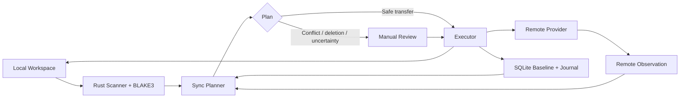

<div align="center">

# AtrisBridge

### Local-first project synchronization for engineering workspaces.

Keep active software and engineering projects portable across computers without relying on ZIP archives, blind folder mirroring, or last-write-wins synchronization.

**Local-first · Conflict-aware · Recovery-focused**

[Türkçe](README_TR.md) · [Architecture](docs/architecture.md) · [Security](docs/security.md) · [Contributing](CONTRIBUTING.md)

</div>

> **Early alpha — `0.1.0-alpha.9`**  
> AtrisBridge is under active development. The core synchronization engine, Google Drive transport, continuous watch, desktop runtime, optional encryption, AtrisHub account integration, updater, and Windows/Linux release foundation are implemented, but the product should still be treated as pre-stable software.

## What is AtrisBridge?

AtrisBridge is a desktop application for keeping active project folders synchronized between computers while keeping synchronization decisions explicit and inspectable.

It is built for project folders that are more important than a simple cloud copy: source code, automation projects, engineering workspaces, configuration-heavy repositories, test assets, and other work where overwriting the wrong version can be costly.

Instead of asking only "which file is newer?", AtrisBridge compares:

1. the current local state,
2. the current remote state,
3. the last synchronized baseline accepted by both sides.

That lets it distinguish a normal transfer from a real conflict, protect destructive operations, and avoid silently replacing a newer copy with an older one.

## Why it exists

Moving a project between machines often turns into the same fragile routine: create a ZIP, upload it, remember which copy is current, merge folders manually, and hope nothing important is overwritten or omitted.

AtrisBridge replaces that routine with a controlled synchronization layer built around durable state, reviewed plans, and recoverable execution.

### Product principles

**Local-first** — Workspace state and synchronization decisions live on the desktop. AtrisHub sign-in is optional for the core local workflow.

**Conflict-aware** — Concurrent edits are surfaced as conflicts instead of being resolved with last-write-wins behavior.

**Safe around deletion** — Deletion is treated as a destructive operation with additional review and recovery safeguards. Continuous watch never automatically applies deletions.

**Inspectable** — Observation, planning, and execution are separate. Uncertain or destructive situations are surfaced instead of hidden.

**Provider-independent architecture** — Google Drive is the first supported remote provider, with the transport layer designed for future providers.

## Core capabilities

### Project workspaces

- Manage multiple local workspaces from one desktop application.
- Scan files in Rust and fingerprint content with BLAKE3.
- Persist synchronization evidence and history in SQLite.
- Use `.atrisbridgeignore` for project-specific exclusions.
- Keep generated output and other common non-project artifacts out of normal synchronization flows.

### Conflict-aware synchronization

- Upload local-only changes.
- Download remote-only changes.
- Detect simultaneous local and remote edits as conflicts.
- Review destructive actions before execution.
- Create local recovery copies before reviewed local deletion.
- Move reviewed Google Drive deletions to Trash instead of performing broad path-based deletion.

### Continuous watch

- Observe configured workspaces with native filesystem events.
- Debounce and coalesce rapid change bursts.
- Re-scan and re-observe the provider before each synchronization decision.
- Detect remote-side changes even when local files are quiet.
- Optionally auto-apply safe transfer-only plans.
- Hand conflicts, uncertainty, and every deletion back to manual review.

### Desktop experience

- System tray with **Open**, **Hide**, and **Quit** actions.
- Close-to-tray behavior so configured watchers can continue running.
- Global Activity Center for active cycles, queued work, conflicts, and workspace status.
- In-app alerts with optional desktop notifications.
- Signed application updater with preview/stable channel support.

### Security and privacy

- Sensitive persisted data uses operating-system-backed secure storage where appropriate.
- AtrisHub sign-in is optional; local workflows continue without an account.
- Optional per-workspace client-side content encryption is available before files are sent to the provider.
- Encrypted workspaces support an exportable recovery key.
- Built-in safety exclusions reduce the chance of synchronizing common local-only or sensitive artifacts.

> Current encrypted transport protects file contents. Filenames and directory structure remain visible to the storage provider.

## How it works



A simplified decision model:

| Local | Remote | Decision |
| --- | --- | --- |
| Changed | Unchanged | Upload |
| Unchanged | Changed | Download |
| Changed | Changed | Conflict |
| Deleted | Unchanged | Reviewed remote Trash action |
| Unchanged | Deleted | Recovery copy, then reviewed local deletion |
| Deleted | Changed | Conflict |
| Changed | Deleted | Conflict |

AtrisBridge refreshes filesystem and provider evidence before execution so an approved plan does not silently operate against stale observations.

## Google Drive

Google Drive is the first supported provider. AtrisBridge uses a restricted rclone-based transport and explicit workspace-to-folder bindings instead of unrestricted cloud mirroring.

The packaged rclone runtime is pinned to `v1.74.4` and verified during preparation/release rather than being committed to the repository as an opaque binary.

See [docs/rclone-transport.md](docs/rclone-transport.md).

## Platforms

Current release packaging targets:

| Platform | Architecture | Packages | Status |
| --- | --- | --- | --- |
| Windows | x64 | NSIS, MSI | Implemented |
| Linux | x64 | AppImage, DEB | Implemented |
| macOS | — | — | Planned |

Release creation is owner-controlled through GitHub Actions. See [docs/release-updater.md](docs/release-updater.md).

## Technology

- **Desktop:** Tauri 2
- **Frontend:** React 19 + TypeScript + Vite
- **Native core:** Rust
- **Local state:** SQLite
- **Fingerprinting:** BLAKE3
- **Remote transport:** restricted rclone integration
- **First provider:** Google Drive

See [docs/architecture.md](docs/architecture.md) for the subsystem design.

## Development

### Requirements

- Node.js LTS
- npm
- Rust stable
- Tauri 2 prerequisites for your operating system

### Run locally

```bash
npm install
npm run sidecar:prepare
npm run tauri:dev
```

### Validate

```bash
npm run build
npm run test:release-contract
cargo fmt --manifest-path src-tauri/Cargo.toml --all -- --check
cargo test --locked --manifest-path src-tauri/Cargo.toml --lib
cargo check --locked --manifest-path src-tauri/Cargo.toml
```

## `.atrisbridgeignore`

Add `.atrisbridgeignore` to a workspace root for project-specific exclusions. Rules are gitignore-compatible, while built-in safety exclusions remain active independently.

```gitignore
artifacts/
cache/
customer-dumps/
*.bak
```

## Project status

The first product foundation is complete through Phase 9:

- ✅ Local workspace inventory and durable state
- ✅ Google Drive observation and restricted transport
- ✅ Guarded backup and staged restore
- ✅ Conflict-aware two-way synchronization
- ✅ Secure persistence and optional content encryption
- ✅ Continuous watch and conservative scheduler
- ✅ Tray runtime, Activity Center, alerts, AtrisHub desktop sessions
- ✅ Signed updater and Windows/Linux release foundation
- ⏳ Additional storage providers
- ⏳ Broader platform packaging
- ⏳ Future Atris ecosystem integrations

AtrisBridge remains alpha software. Compatibility, migration behavior, provider coverage, and production hardening will continue to evolve.

## Documentation

- [Architecture](docs/architecture.md)
- [Synchronization engine](docs/sync-engine.md)
- [Backup engine](docs/backup-engine.md)
- [Restore engine](docs/restore-engine.md)
- [Continuous watch](docs/continuous-watch.md)
- [Desktop runtime](docs/desktop-runtime.md)
- [Security model](docs/security.md)
- [AtrisHub account integration](docs/atrishub-account.md)
- [Release and updater](docs/release-updater.md)

## Security and responsible use

AtrisBridge can reduce accidental leakage and destructive synchronization risk, but it does not grant permission to upload proprietary, regulated, customer-controlled, or company-controlled data to third-party infrastructure. Always follow the policies and authorization requirements that apply to the project being synchronized.

Do not report security vulnerabilities in public issues. See [SECURITY.md](SECURITY.md).

## Contributing

Contributions and technical discussion are welcome. Please read [CONTRIBUTING.md](CONTRIBUTING.md) before opening a pull request.

## License

AtrisBridge is open source under the [Apache License 2.0](LICENSE).
