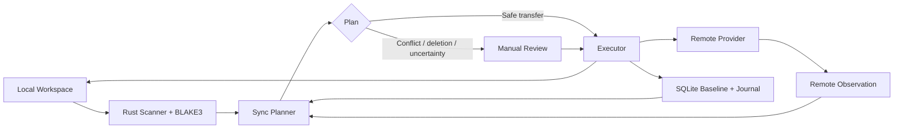

<div align="center">

<picture>
  <source media="(prefers-color-scheme: dark)" srcset="public/brand/atrisbridge-logo-dark.svg">
  
</picture>

### Mühendislik projeleri için local-first senkronizasyon uygulaması.

Aktif yazılım ve mühendislik projelerini ZIP arşivlerine, kör klasör eşitlemeye veya last-write-wins yaklaşımına güvenmeden bilgisayarlar arasında taşınabilir tutun.

**Local-first · Conflict-aware · Recovery odaklı**

[English](README.md) · [Mimari](docs/architecture.md) · [Güvenlik](docs/security.md) · [Katkı](CONTRIBUTING.md)

</div>

> **Erken alpha — `0.1.0-alpha.9`**  
> AtrisBridge aktif olarak geliştiriliyor. Temel senkronizasyon motoru, Google Drive transport, continuous watch, desktop runtime, opsiyonel encryption, AtrisHub account entegrasyonu, updater ve Windows/Linux release altyapısı uygulanmış durumda; ancak ürün henüz stable olarak değerlendirilmemelidir.

## AtrisBridge nedir?

AtrisBridge, aktif proje klasörlerini farklı bilgisayarlar arasında senkronize ederken kararların açık, takip edilebilir ve mümkün olduğunca güvenli kalmasını amaçlayan bir masaüstü uygulamasıdır.

Basit bir cloud kopyasından daha değerli olan çalışma alanları için tasarlanır: source code projeleri, otomasyon uygulamaları, mühendislik workspaceleri, yoğun konfigürasyon içeren repository'ler, test varlıkları ve yanlış sürümün üzerine yazılmasının ciddi sonuç doğurabileceği diğer proje klasörleri.

AtrisBridge yalnızca "hangi dosya daha yeni?" sorusunu sormaz. Her managed path için üç farklı state'i karşılaştırır:

1. mevcut local durum,
2. mevcut remote durum,
3. iki tarafın en son kabul ettiği synchronized baseline.

Bu model normal bir transfer ile gerçek conflict'i ayırmayı, destructive işlemleri korumayı ve daha eski bir kopyanın daha yeni bir dosyanın üzerine sessizce yazılmasını engellemeyi mümkün kılar.

## Neden AtrisBridge?

Projeleri bilgisayarlar arasında taşımak çoğu zaman aynı kırılgan rutine dönüşür: ZIP oluştur, bir yere yükle, hangi kopyanın güncel olduğunu hatırla, klasörleri manuel birleştir ve önemli bir dosyanın üzerine yazılmadığını um.

AtrisBridge bu süreci durable state, review edilebilir planlar ve recoverable execution üzerine kurulu kontrollü bir senkronizasyon katmanıyla değiştirir.

### Ürün prensipleri

**Local-first** — Workspace state ve senkronizasyon kararları masaüstünde kalır. Temel local kullanım için AtrisHub hesabı zorunlu değildir.

**Conflict-aware** — İki tarafta aynı anda değişen dosyalar last-write-wins ile çözülmez; conflict olarak kullanıcıya gösterilir.

**Deletion konusunda korumacı** — Silme işlemleri normal transfer gibi ele alınmaz. Ek review ve recovery korumaları vardır. Continuous watch hiçbir deletion işlemini otomatik uygulamaz.

**Takip edilebilir** — Observation, planning ve execution ayrı katmanlardır. Belirsiz veya destructive durumlar gizlenmek yerine görünür hale getirilir.

**Provider-independent mimari** — İlk remote provider Google Drive'dır; transport katmanı ileride başka provider'ların eklenebilmesi için ayrıştırılmıştır.

## Temel özellikler

### Proje workspaceleri

- Birden fazla local workspace'i tek masaüstü uygulamasından yönetin.
- Rust scanner ile dosyaları tarayın ve BLAKE3 ile content fingerprint üretin.
- Synchronization evidence ve geçmişini SQLite üzerinde kalıcı tutun.
- Projeye özel exclude kuralları için `.atrisbridgeignore` kullanın.
- Generated output ve yaygın local-only artifact'ları normal senkronizasyon akışının dışında tutun.

### Conflict-aware synchronization

- Yalnızca local'de değişen dosyaları upload edin.
- Yalnızca remote'da değişen dosyaları download edin.
- Aynı anda iki tarafta değişen dosyaları conflict olarak algılayın.
- Destructive aksiyonları execution öncesinde review edin.
- Reviewed local deletion öncesinde recovery copy oluşturun.
- Reviewed Google Drive deletion işlemlerini geniş path silme yerine Trash üzerinden uygulayın.

### Continuous watch

- Configured workspace'leri native filesystem event'leriyle gözlemleyin.
- Hızlı değişiklik burst'lerini debounce/coalesce edin.
- Her senkronizasyon kararından önce tekrar scan ve provider observation yapın.
- Local dosyalar sessizken başka bilgisayardan gelen remote değişiklikleri de algılayın.
- İstenirse yalnızca güvenli transfer-only planları otomatik uygulayın.
- Conflict, uncertainty ve tüm deletion işlemlerini manuel review'a bırakın.

### Desktop deneyimi

- **Open**, **Hide** ve **Quit** aksiyonlarına sahip system tray.
- Ana pencere kapandığında configured watcher'ların çalışmaya devam edebilmesi için close-to-tray davranışı.
- Active cycle, queued work, conflict ve workspace durumunu gösteren global Activity Center.
- In-app alert'ler ve opsiyonel desktop notification desteği.
- Preview/stable kanal desteğine sahip signed updater.

### Güvenlik ve gizlilik

- Kalıcı hassas veriler uygun olduğu durumlarda işletim sisteminin secure storage altyapısında tutulur.
- AtrisHub girişi opsiyoneldir; local workflow account olmadan çalışmaya devam eder.
- Workspace bazında opsiyonel client-side content encryption kullanılabilir.
- Encrypted workspaceler export edilebilir recovery key desteğine sahiptir.
- Built-in safety exclusions yaygın local-only veya hassas artifact'ların yanlışlıkla senkronize edilme riskini azaltır.

> Mevcut encrypted transport dosya **içeriğini** korur. Dosya adları ve klasör yapısı storage provider tarafından görülebilir.

## Nasıl çalışır?



Basitleştirilmiş decision modeli:

| Local | Remote | AtrisBridge kararı |
| --- | --- | --- |
| Değişti | Aynı | Upload |
| Aynı | Değişti | Download |
| Değişti | Değişti | Conflict |
| Silindi | Aynı | Reviewed remote Trash aksiyonu |
| Aynı | Silindi | Recovery copy, ardından reviewed local deletion |
| Silindi | Değişti | Conflict |
| Değişti | Silindi | Conflict |

AtrisBridge execution öncesinde filesystem ve provider evidence'i yeniden okur; böylece onaylanmış bir plan stale observation üzerinden sessizce çalışmaz.

## Google Drive

Google Drive şu anda desteklenen ilk provider'dır. AtrisBridge unrestricted cloud mirroring yerine restricted rclone transport ve açık workspace-to-folder binding kullanır.

Paketlenen rclone runtime `v1.74.4` sürümüne pinlenmiştir ve opaque binary olarak repoya commit edilmek yerine preparation/release sırasında doğrulanır.

Ayrıntılar: [docs/rclone-transport.md](docs/rclone-transport.md).

## Platformlar

Mevcut release packaging hedefleri:

| Platform | Mimari | Paketler | Durum |
| --- | --- | --- | --- |
| Windows | x64 | NSIS, MSI | Uygulandı |
| Linux | x64 | AppImage, DEB | Uygulandı |
| macOS | — | — | Planlanıyor |

Release oluşturma GitHub Actions üzerinden owner-controlled şekilde çalışır. Ayrıntılar: [docs/release-updater.md](docs/release-updater.md).

## Teknoloji

- **Desktop:** Tauri 2
- **Frontend:** React 19 + TypeScript + Vite
- **Native core:** Rust
- **Local state:** SQLite
- **Fingerprinting:** BLAKE3
- **Remote transport:** restricted rclone integration
- **İlk provider:** Google Drive

Subsystem tasarımı için [docs/architecture.md](docs/architecture.md) belgesine bakabilirsiniz.

## Geliştirme

### Gereksinimler

- Node.js LTS
- npm
- Rust stable
- işletim sisteminiz için Tauri 2 gereksinimleri

### Local çalıştırma

```bash
npm install
npm run sidecar:prepare
npm run tauri:dev
```

### Doğrulama

```bash
npm run build
npm run test:release-contract
cargo fmt --manifest-path src-tauri/Cargo.toml --all -- --check
cargo test --locked --manifest-path src-tauri/Cargo.toml --lib
cargo check --locked --manifest-path src-tauri/Cargo.toml
```

## `.atrisbridgeignore`

Projeye özel exclude kuralları gerektiğinde workspace root'a `.atrisbridgeignore` ekleyebilirsiniz. Kurallar gitignore-compatible'dır; built-in safety exclusions bundan bağımsız olarak aktif kalır.

```gitignore
artifacts/
cache/
customer-dumps/
*.bak
```

## Proje durumu

İlk ürün foundation'ı Phase 9'a kadar tamamlandı:

- ✅ Local workspace inventory ve durable state
- ✅ Google Drive observation ve restricted transport
- ✅ Guarded backup ve staged restore
- ✅ Conflict-aware two-way synchronization
- ✅ Secure persistence ve opsiyonel content encryption
- ✅ Continuous watch ve korumacı scheduler
- ✅ Tray runtime, Activity Center, alert'ler ve AtrisHub desktop session
- ✅ Signed updater ve Windows/Linux release foundation
- ⏳ Ek storage provider'lar
- ⏳ Daha geniş platform packaging
- ⏳ Gelecekteki Atris ecosystem entegrasyonları

AtrisBridge halen alpha yazılımdır. Compatibility, migration davranışları, provider kapsamı ve production hardening geliştirilmeye devam edecektir.

## Dokümantasyon

- [Mimari](docs/architecture.md)
- [Synchronization engine](docs/sync-engine.md)
- [Backup engine](docs/backup-engine.md)
- [Restore engine](docs/restore-engine.md)
- [Continuous watch](docs/continuous-watch.md)
- [Desktop runtime](docs/desktop-runtime.md)
- [Security model](docs/security.md)
- [AtrisHub account integration](docs/atrishub-account.md)
- [Release ve updater](docs/release-updater.md)

## Güvenlik ve sorumlu kullanım

AtrisBridge yanlışlıkla veri sızdırma ve destructive synchronization riskini azaltmaya yardımcı olabilir; ancak proprietary, regulated, customer-controlled veya company-controlled verileri üçüncü taraf altyapısına yüklemek için kullanıcıya yetki vermez. Senkronize edilen projeye uygulanan şirket politikası, sözleşme ve yetkilendirme gereksinimlerine her zaman uyulmalıdır.

Security vulnerability'leri public issue üzerinden paylaşmayın. [SECURITY.md](SECURITY.md) belgesini kullanın.

## Katkı

Katkılar ve teknik tartışmalar açıktır. Pull request açmadan önce [CONTRIBUTING.md](CONTRIBUTING.md) belgesini okuyun.

## Lisans

AtrisBridge [Apache License 2.0](LICENSE) ile open source olarak lisanslanmıştır.
